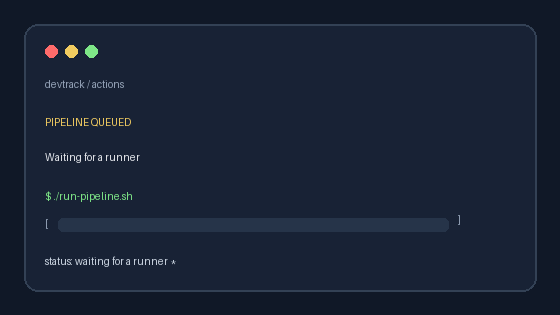
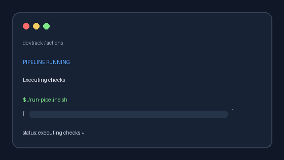
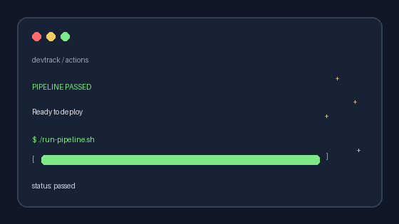

## Terraform Pipelines

This repository now uses one reusable Terraform workflow template with two manual entrypoints:

- `.github/workflows/azure-deploy.yml` provisions the Azure Web App infrastructure from `infra/terraform`
- `.github/workflows/runner-infra.yml` provisions the Azure-hosted GitHub Actions runner from `infra/terraform/runner`

### Required GitHub secrets

- `AZURE_SUBSCRIPTION_ID`
- `AZURE_TENANT_ID`
- `AZURE_CLIENT_ID`
- `AZURE_CLIENT_SECRET`
- `AZURE_WEBAPP_NAME`
- `AZURE_PUBLISH_PROFILE`
- `AZURE_RUNNER_SSH_PUBLIC_KEY`
- `GH_RUNNER_ADMIN_TOKEN`

`GH_RUNNER_ADMIN_TOKEN` needs permission to create self-hosted runner registration tokens for this repository. `AZURE_RUNNER_SSH_PUBLIC_KEY` should contain the public key for the VM admin account.

The runner workflow registers a repository-scoped Linux runner with the built-in `self-hosted` and `linux` labels plus the custom `azure` and `devtrack` labels.

### Recommended order

1. Run `.github/workflows/runner-infra.yml` with `terraform_action=apply`.
2. Wait for the runner to appear online in the repository's Actions runner settings.
3. Run `.github/workflows/azure-deploy.yml` to provision or update the hosting infra.

4. Run `.github/workflows/app-deploy.yml` to deploy the Django application on the self-hosted runner.

Use the [pipeline status board](../../docs/status-board.md) to expand the infrastructure run, click each Terraform stage to load its inline log, and open the full GitHub job log for failures.

## Pipeline GIF gallery

